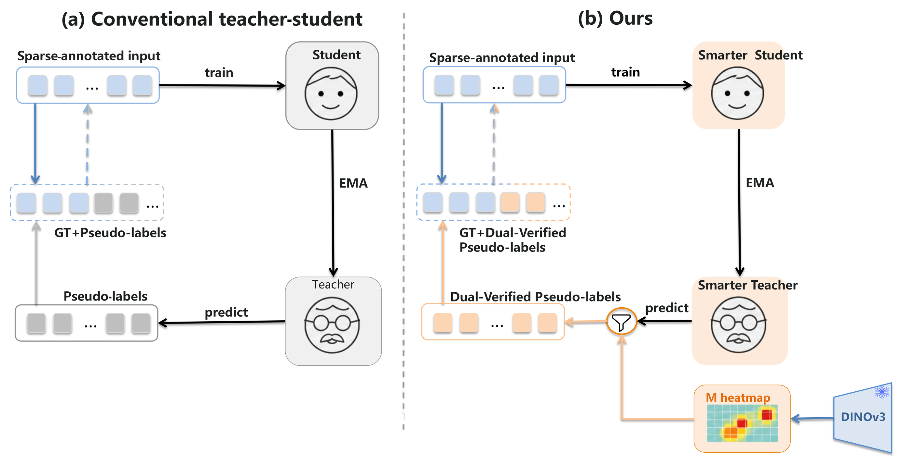
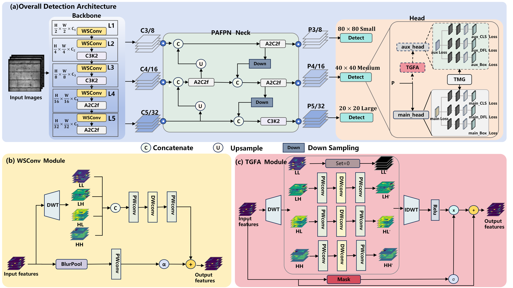

# DECoNet

Official implementation of **DECoNet: Dual-Evidence Collaborative Network for Robust Photovoltaic EL Defect Detection under Missing Annotations**.

This repository contains the implementation and evaluation code needed by that manuscript, together with its method overview and architecture figures. Dataset files, M-maps, prototype banks, experiment outputs, model weights, and the manuscript PDF are intentionally excluded.

The vendored YOLOv12 runtime is limited to the object-detection path required by DECoNet. Unrelated upstream tasks, model-zoo configurations, demos, tracking, HUB integration, sample assets, and solution applications have been removed.

## Method overview



**Figure 1.** Teacher-student learning frameworks: (a) conventional teacher-student learning; (b) DECoNet with a fixed normal-reference anomaly prior.

## Method coverage

The code implements the components reported in the paper:

- a frozen DINOv3 ViT-B/16 normal-prototype bank and offline M-map;
- an EMA teacher and Teacher-and-M-map Guided loss (TMG): negative suppression (NSM), pseudo-label recovery (PLR), and soft-label mixing (SLM);
- Wavelet-Separable Convolution (WSConv) in all five backbone downsampling stages;
- training-only Target-Guided Feature Augmentation (TGFA) and an independently parameterized auxiliary head;
- inference through only the WSConv backbone, shared neck, and main detection head.

The detector is based on YOLOv12n at upstream commit `d3cbe10`. The inherited code remains under the AGPL-3.0 license; see [LICENSE](LICENSE).

### Architecture



**Figure 2.** Architecture of DECoNet: (a) overall detection architecture; (b) WSConv module; (c) TGFA module. TGFA and the auxiliary detection head are used only during training.

## Paper configuration

| Setting | Value |
|---|---:|
| Input size | 640 × 640 |
| Epochs / batch size | 100 / 64 |
| Optimizer | AdamW |
| Initial LR / final factor | 1e-4 / 0.01 |
| LR schedule | Cosine annealing |
| Momentum / weight decay | 0.937 / 5e-4 |
| Warm-up / AMP | 5 epochs / enabled |
| TMG burn-in | 5,000 steps |
| Teacher thresholds | NSM 0.45→0.30; PLR high 0.50→0.40; PLR low 0.35→0.25 |
| Fixed M-map thresholds | NSM 0.30; PLR 0.25 |
| PLR target weights | 0.75 × confidence; 0.50 × confidence |
| SLM coefficient / auxiliary weight | 0.10 / 0.25 |

The paper reports **95.65 mAP50**, **70.85 mAP50:95**, **93.29 precision**, and **92.14 recall** on augmented PVEL-AD. Its inference graph has **2.28M parameters** and **5.67 GFLOPs** at 640 × 640, using two FLOPs per multiply-accumulate.

## Installation

Python 3.11 and a CUDA-enabled PyTorch environment are recommended.

```bash
git clone https://github.com/Yufei-D/DECoNet.git
cd DECoNet
pip install -r requirements.txt
```

FlashAttention is optional; the included YOLOv12 attention code falls back to PyTorch scaled-dot-product attention when it is unavailable.

The official [DINOv3 ViT-B/16 checkpoint](https://huggingface.co/facebook/dinov3-vitb16-pretrain-lvd1689m) is access-gated. Accept Meta's model terms on Hugging Face and authenticate locally before running the prototype or M-map scripts.

## Dataset layout

The dataset is not included. Copy `configs/pvelad.example.yaml`, replace its root path, and arrange each split in YOLO detection format:

```text
augmented-PVEL-AD/
├── train/
│   ├── images/
│   ├── labels/
│   └── M_heatmaps/       # generated .npy files
├── val/
│   ├── images/
│   └── labels/
└── test/
    ├── images/
    └── labels/
```

The paper uses disjoint training, validation, and test partitions. M-maps are needed only for detector training.

## Reproduction

Build the `K=1024` normal-prototype bank from the paper’s 11,353 defect-free training-pool images:

```bash
python scripts/build_normal_prototypes.py \
  --normal-images /path/to/normal/images \
  --output /path/to/generated/dinov3_normal_k1024.pt
```

Generate fixed M-maps for the detector training images:

```bash
python scripts/precompute_m_maps.py \
  --images /path/to/augmented-PVEL-AD/train/images \
  --prototype-bank /path/to/generated/dinov3_normal_k1024.pt \
  --output-dir /path/to/augmented-PVEL-AD/train/M_heatmaps
```

Train from the official YOLOv12n weights (the default). Matching backbone, neck, and main-head tensors are transferred; DECoNet-specific tensors without a compatible source are initialized by the model definition.

```bash
python scripts/train.py --data configs/pvelad.local.yaml --device 0
```

Evaluate validation or test data and export both overall JSON and per-class CSV metrics:

```bash
python scripts/evaluate.py \
  --weights /path/to/best.pt \
  --data configs/pvelad.local.yaml \
  --split test
```

Recalculate inference parameters and GFLOPs without fusing the model:

```bash
python scripts/model_stats.py --weights /path/to/best.pt --imgsz 640
```

Generate the class-wise additional box-removal splits used by the paper’s robustness study:

```bash
python scripts/make_missing_labels.py \
  --labels /path/to/augmented-PVEL-AD/train/labels \
  --output-root /path/to/augmented-PVEL-AD/train \
  --rates 30 50 70 90
```

Only training boxes are removed; validation and test annotations must remain unchanged.

## Repository map

- `docs/figures/`: the method overview and architecture figures (Figures 1 and 2).
- `configs/models/yolo12n-deconet.yaml`: paper model architecture.
- `ultralytics/nn/modules/wscdown.py`: WSConv.
- `ultralytics/nn/modules/tgfa.py`: TGFA.
- `ultralytics/utils/deconet_loss.py`: TMG and auxiliary loss.
- `scripts/`: prototype/M-map preparation, training, evaluation, statistics, and missing-label protocols.
- `tests/test_deconet.py`: architecture, training-only branch, paper-default, and artifact checks.

## Artifact policy

Git ignores model/prototype files (`.pt`, `.pth`, `.ckpt`, `.safetensors`), generated maps (`.npy`, `.npz`), datasets, and run directories. No such artifact is part of this release.
