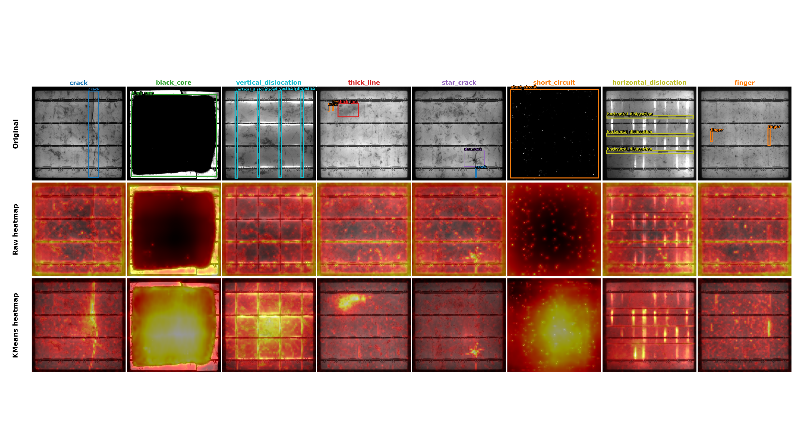
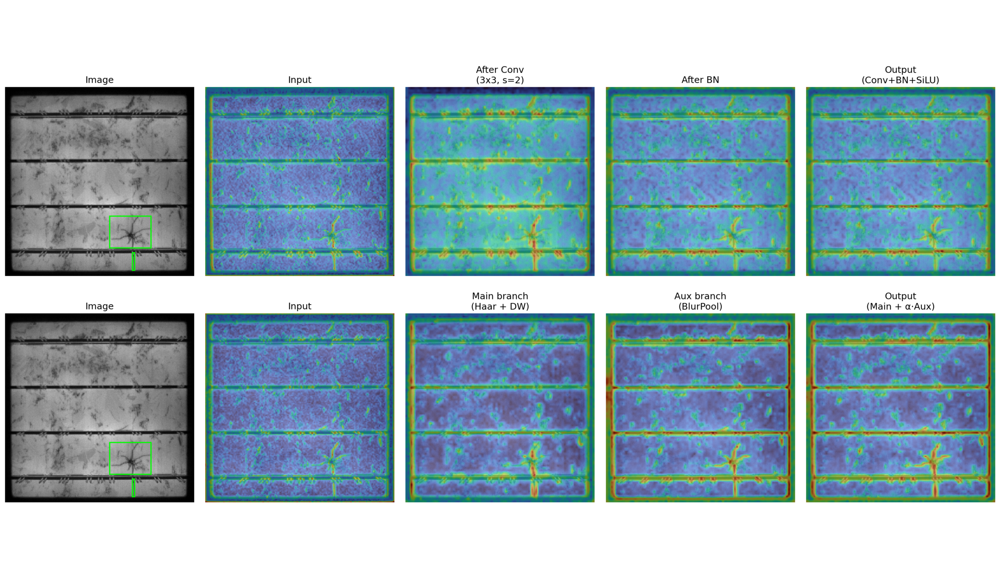

# Additional visualizations

The [main README](../README.md) presents the method overview, architecture, and qualitative detection results. This page presents the two additional visualizations from the paper. The PNG files are the original paper figures.

## Normal-reference anomaly maps

**Figure 3.** Top: images with ground-truth boxes. Middle: maps from within-image feature differences. Bottom: our KMeans heatmaps. Brighter map regions indicate higher anomaly responses.

DECoNet uses normal prototypes constructed from defect-free images as references to generate its anomaly prior (M-map).

## WSConv feature responses

**Figure 4.** Feature response comparison between a stride-2 convolutional block and WSConv. Top: responses at successive stages of the convolutional block. Bottom: WSConv branch responses and their fused output.
